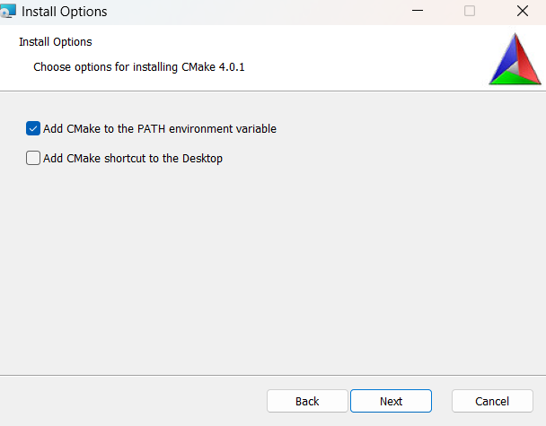
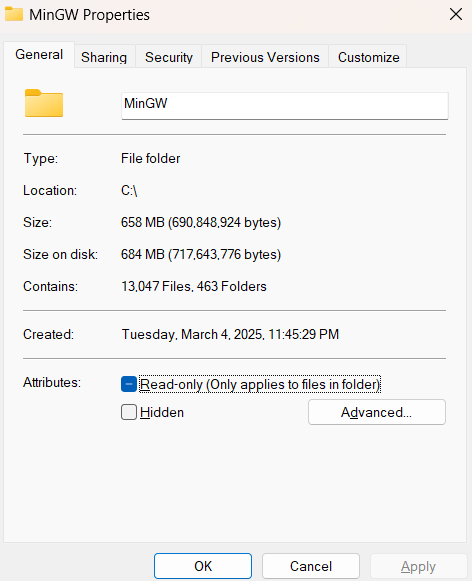
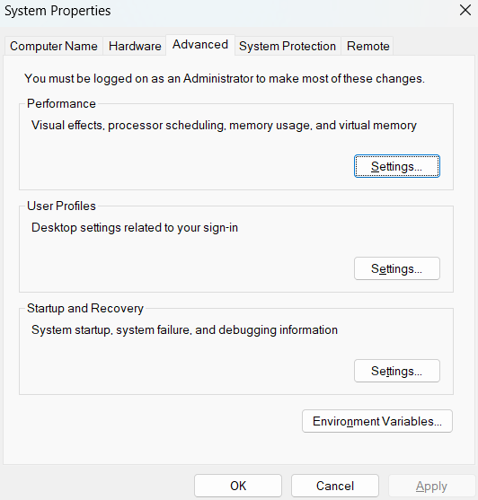
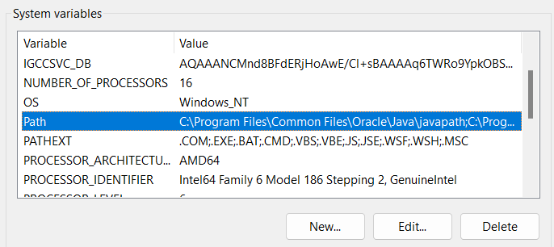
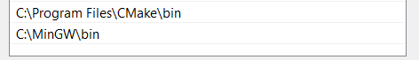
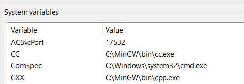

# Operation Null Mind

Note: If you're viewing this through a zip file, this file looks a lot better on the github repository description:

## Table of Contents
- [About the codebase](#about-the-codebase)
- [Releases](#releases)
- [How to compile for Windows](#how-to-compile-for-windows)
  - [Step 1: Clone repository](#step-1-clone-repository)
  - [Step 2: Install Cmake](#step-2-install-cmake)
  - [Step 3: Install MinGW compiler](#step-3-install-mingw-compiler)
  - [Step 4: Build, Compile and Run](#step-4-build-compile-and-run)

## About the codebase:
For the code-related stuffs, check out our project documentation website generated by doxygen!
https://mangathemango.github.io/Operation-Null-Mind/html/index.html

## Releases

The game's releases can be found on this link:
  https://github.com/mangathemango/Operation-Null-Mind/releases

## How to compile for Windows

This section is for people who wants to contribute to the game's code, or just mess around with it. If you just want to play the game, refer to the Releases tab.

### Step 1: Clone repository

On this repository, you can go File -> Download .zip to download the repository. 

Otherwise if you have Git, you can enter this command:
``git clone https://github.com/mangathemango/Operation-Null-Mind/``

### Step 2: Install Cmake

For Operation Null Mind, we use Cmake 4.0.1, which can be downloaded [here](
https://github.com/Kitware/CMake/releases/download/v4.0.1/cmake-4.0.1-windows-x86_64.msi). Click on the downloaded file and follow the prompts. Make sure "Add CMake to the PATH environment variable" is on.



Afterwards, to check if Cmake is installed correctly, open a terminal, and enter:

```
cmake --version
```

The terminal shold output the following. You may need to reboot the computer, or reopen the terminal to get this message.
```
cmake version 4.0.1

CMake suite maintained and supported by Kitware (kitware.com/cmake).
```


### Step 3: Install MinGW compiler

For this project, we use MinGW 14.2.0 built by MinGW-Builds project, which can be downloaded [here](https://github.com/niXman/mingw-builds-binaries/releases/download/14.2.0-rt_v12-rev1/i686-14.2.0-release-win32-dwarf-msvcrt-rt_v12-rev1.7z). 

After you extract the 7z file, you should see a folder called ***mingw32***. Rename this folder to "**MinGW**", and then move it to the root of your (C:) disk.

If you right click the MinGW folder, and select "Properties", it should show something like this:



Afterwards, search your Windows for ***"Edit the system environment variables"***, then click on "Environment Variables..." 



Under **System variables**, find **Path** variable, then click **Edit**



In this screen, click "Add", and type the path of the ***bin*** folder inside the MinGW folder. It should be something like ***C:/MinGW/bin***. 

*(It should be noted that for whatever reason, our game wouldn't compile on other compilers (eg. MSYS2 or MSVC). So if any of your system variables seem to include that, remove it)*

After that, click "Ok".



After that, wait a while (again, you might need to reboot your laptop or your terminal), and then open the terminal and type:

```
gcc --version
```

If the output is:

```
gcc.exe (i686-win32-dwarf-rev1, Built by MinGW-Builds project) 14.2.0
Copyright (C) 2024 Free Software Foundation, Inc.
This is free software; see the source for copying conditions.  There is NO
warranty; not even for MERCHANTABILITY or FITNESS FOR A PARTICULAR PURPOSE.
```

Congratulations, you have installed MinGW successfully!

Finally, go back to the Environment Variables tab from earlier, Under **System Variables**, (NOT INSIDE PATH BTW), add 2 variables as follows:

`CC` - `C:\MinGW\bin\cc.exe`

`CXX` - `C:\MinGW\bin\cpp.exe`




### Step 4: Build, Compile and Run

To build, there are 2 ways you can do this

If you have vscode, open the Operation Null Mind folder from step 1 with vscode, and `Ctrl+Shift+B`. It should all run fine.

Otherwise, you can right click the Operation Null Mind folder, open with terminal, and run these 4 commands:

```
Get-ChildItem -Path .\src -Filter *.C -Recurse | Rename-Item -NewName {$_.name -replace '\.C$','.c'}
cmake -S . -B build "MinGW Makefiles"
cmake --build build
./build/Operation-Null-Mind
```
